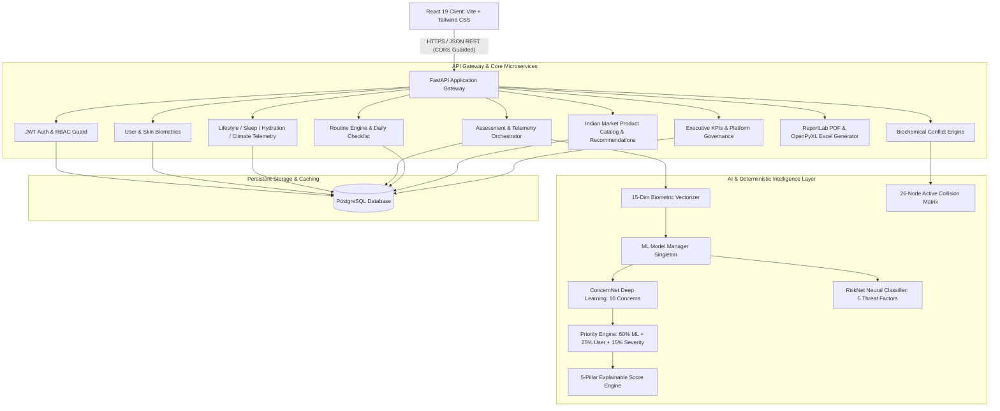

# DermaIQ — AI Skin Intelligence & Personalized Skincare Planner

[](file:///f:/PROJECTS/Infosys/AI%20Skin)
[](file:///f:/PROJECTS/Infosys/AI%20Skin/backend)
[](file:///f:/PROJECTS/Infosys/AI%20Skin/backend)
[](file:///f:/PROJECTS/Infosys/AI%20Skin/frontend)
[](file:///f:/PROJECTS/Infosys/AI%20Skin/backend/intelligence)
[](file:///f:/PROJECTS/Infosys/AI%20Skin)
[](LICENSE)

> **DermaIQ** is an enterprise-grade dermatological intelligence platform. It combines deep learning neural networks (PyTorch), deterministic biochemical interaction engines, real-time lifestyle telemetry, and clinical workflows to deliver personalized skincare regimes, active ingredient conflict warnings, and patient-doctor collaboration.

---

## 📑 Table of Contents

1. [Platform Overview & Problem Statement](#1-platform-overview--problem-statement)
2. [System Architecture & Data Flow](#2-system-architecture--data-flow)
3. [Technology Stack](#3-technology-stack)
4. [Project Directory Structure](#4-project-directory-structure)
5. [Feature Catalog & Code Implementation Map](#5-feature-catalog--code-implementation-map)
6. [AI/ML Intelligence & Mathematical Models](#6-aiml-intelligence--mathematical-models)
7. [Database Schema & Entity Relationship](#7-database-schema--entity-relationship)
8. [Local Development Setup](#8-local-development-setup)
9. [Docker Multi-Container Deployment](#9-docker-multi-container-deployment)
10. [REST API Reference](#10-rest-api-reference)
11. [Testing & Quality Assurance](#11-testing--quality-assurance)
12. [Security Architecture & Hardening](#12-security-architecture--hardening)
13. [Medical Safety Disclaimer](#13-medical-safety-disclaimer)

---

## 1. Platform Overview & Problem Statement

### The Problem
- **Chemical Collisions & Barrier Damage**: Everyday consumers frequently combine incompatible cosmetic actives (e.g. applying high-concentration Glycolic Acid with Retinol), compromising the acid mantle and lipid barrier.
- **Generic Skincare Quizzes**: The beauty industry relies on shallow static quizzes that ignore critical dynamic biometric variables such as circadian rhythm, stress spikes, water intake, and localized UV exposure.
- **Disconnected Care Teams**: Patients lack a structured platform where home routines, certified skincare consultants, and medical dermatologists can share objective diagnostic logs.

### The DermaIQ Solution
DermaIQ establishes an end-to-end clinical loop:
- **Biometric Multi-Pillar Scoring**: Calculates skin barrier resilience through an explainable, deterministic mathematical model ($35\%\text{ Condition} + 20\%\text{ Consistency} + 20\%\text{ Lifestyle} + 15\%\text{ Sleep} + 10\%\text{ Hydration}$).
- **Deep Learning Biometric Inference**: Dual neural networks (**ConcernNet** and **RiskNet**) classify 10 distinct skin concerns and 5 lifestyle threat dimensions.
- **Biochemical Conflict Engine**: An active ingredient graph analyzing 26 canonical chemical entities to identify hazards, dosage risks, and allergen violations.
- **Curated Indian Market Catalog**: 66 dermatologically tested products denominated in INR, organized by price tier (Budget, Mid-Range, Luxury) with side-by-side comparison.
- **Four Specialized Role Workspaces**: Dedicated portals for Consumers, Skincare Consultants, Licensed Dermatologists, and System Administrators.

---

## 2. System Architecture & Data Flow



---

## 3. Technology Stack

| Domain | Technology | Key Libraries / Frameworks | Purpose & Highlights |
|:---|:---|:---|:---|
| **Frontend** | React 19, JavaScript (ES6+), Vite | `react-router-dom`, `recharts`, `lucide-react`, `axios` | Single-page application, interactive radar charts, animated wizards, fast HMR. |
| **Styling** | Vanilla CSS + Tailwind CSS v4 | CSS Custom Properties, Glassmorphism | Custom luxury clinical design system, dark mode sidebar, zero UI frameworks overhead. |
| **Backend** | Python 3.11 / 3.13, FastAPI | `uvicorn`, `pydantic v2`, `sqlalchemy 2.0`, `alembic` | High-throughput asynchronous ASGI REST API, automatic OpenAPI/Swagger documentation. |
| **Machine Learning** | PyTorch, Scikit-learn | `torch.nn`, `StandardScaler`, `pandas`, `numpy`, `joblib` | Deep neural network inference for 10 skin concerns and 5 risk classifications. |
| **Database** | PostgreSQL 16 | `asyncpg`, `psycopg2-binary` | Relational storage for users, biometric logs, assessment history, and product catalogs. |
| **Document Generation** | ReportLab, OpenPyXL | `reportlab.platypus`, `openpyxl` | Automated clinical PDF medical dossiers and multi-sheet administrative Excel exports. |
| **Containerization** | Docker, Docker Compose | Multi-stage Dockerfiles, Alpine images | Production-ready isolated environments for frontend, backend, and PostgreSQL. |
| **Authentication** | JWT, Passlib | `python-jose`, `bcrypt` | Stateless access/refresh token rotation, role-based route guardrails. |

---

## 4. Project Directory Structure

```text
AI Skin/
├── docker-compose.yml                     # Full-stack multi-container orchestration
├── README.md                              # Complete architectural & technical documentation
│
├── backend/
│   ├── Dockerfile                         # Production Python backend container
│   ├── requirements.txt                   # Backend dependencies
│   ├── alembic.ini                        # Database migration configuration
│   ├── alembic/versions/                  # Alembic revision migration history
│   │
│   ├── intelligence/                      # AI / Deep Learning Package
│   │   ├── models/
│   │   │   ├── concern_net.py             # PyTorch ConcernNet neural network (15->64->32->10)
│   │   │   ├── risk_net.py                # PyTorch RiskNet neural network (8->32->5)
│   │   │   └── dataset.py                 # PyTorch Dataset & DataLoader
│   │   ├── preprocessing/
│   │   │   └── feature_builder.py         # 15-dimensional biometric feature extractor
│   │   ├── saved_models/                  # Trained neural weights (.pt) & scalers (.pkl)
│   │   ├── training/                      # Dataset generation and model training scripts
│   │   └── inference/
│   │       └── ml_model_manager.py        # Thread-safe ML model inference singleton
│   │
│   ├── app/
│   │   ├── main.py                        # FastAPI entrypoint, middleware, CORS, routers
│   │   ├── core/
│   │   │   ├── config.py                  # Pydantic Settings & environment variables
│   │   │   ├── security.py                # Bcrypt password hashing & JWT token generation
│   │   │   └── dependencies.py            # Database sessions & RBAC route authorization
│   │   ├── db/
│   │   │   ├── database.py                # SQLAlchemy engine & session factory
│   │   │   ├── base.py                    # Declarative base model registry
│   │   │   ├── seed.py                    # Default system accounts & reference data
│   │   │   └── seed_genuine_datasets.py   # 26 canonical actives & 66 INR products
│   │   ├── models/                        # SQLAlchemy database entity definitions
│   │   │   ├── user.py                    # User, UserProfile, UserRole enum
│   │   │   ├── skin_profile.py            # SkinProfile, SkinConcern, UserSkinConcern
│   │   │   ├── hydration.py               # HydrationRecord daily intake logs
│   │   │   ├── sleep.py                   # SleepRecord duration & quality metrics
│   │   │   ├── lifestyle.py               # LifestyleRecord stress, diet, activity
│   │   │   ├── environment.py             # EnvironmentalExposureRecord climate/UV logs
│   │   │   ├── assessment.py              # SkinAssessment, AssessmentConcern, SkinScore
│   │   │   ├── ingredient.py              # Ingredient, IngredientInteraction graph
│   │   │   ├── product.py                 # Product, ProductCategory, BudgetTier
│   │   │   ├── routine.py                 # Routine, RoutineStep (AM/PM/Weekly)
│   │   │   ├── connection.py              # ProfessionalConnection patient-doctor links
│   │   │   ├── notification.py            # Notification event alerts
│   │   │   └── system_settings.py         # CMS platform policies & maintenance state
│   │   ├── schemas/                       # Pydantic validation schemas (Request/Response)
│   │   ├── api/routes/                    # REST API route controllers
│   │   └── services/                      # Business logic service layer
│   │       ├── assessment_service.py      # Diagnostic assessment orchestration
│   │       ├── ingredient_service.py      # Ingredient safety & conflict resolution
│   │       ├── product_service.py         # Catalog filtering & recommendation logic
│   │       ├── progress_service.py        # Historical skin score tracking
│   │       ├── routine_service.py         # Routine generation & checklist state
│   │       ├── report_service.py          # ReportLab clinical PDF generation
│   │       ├── notification_service.py    # Notification event triggers & scheduling
│   │       ├── settings_service.py        # Legal CMS & platform settings
│   │       ├── weather_service.py         # Climate & environmental telemetry
│   │       └── intelligence/              # Algorithmic decision engines
│   │           ├── concern_analyzer.py    # ConcernNet output analysis & heuristics
│   │           ├── risk_analyzer.py       # RiskNet threat evaluation
│   │           ├── priority_engine.py     # 60/25/15 concern priority weighting
│   │           ├── score_engine.py        # 35/20/20/15/10 5-pillar mathematical score
│   │           ├── routine_generator.py   # Dynamic multi-phase routine builder
│   │           └── summary_engine.py      # Clinical summary synthesis
│   │
│   └── tests/                             # Pytest automated test suites
│       ├── test_api.py                    # Auth, profiles, and lifestyle API tests
│       └── test_connections.py           # RBAC permissions and connection tests
│
└── frontend/
    ├── Dockerfile                         # Production frontend Nginx container
    ├── package.json                       # Dependencies & build scripts
    ├── vite.config.js                     # Vite build configuration
    └── src/
        ├── App.jsx                        # React Router routing & ProtectedRoute guards
        ├── main.jsx                       # React DOM root mounting
        ├── index.css                      # Global design system tokens & styles
        ├── context/
        │   ├── AuthContext.jsx            # User session, JWT tokens, RBAC state
        │   └── MaintenanceContext.jsx     # Emergency maintenance mode state
        ├── components/
        │   ├── Layout.jsx                 # Navigation sidebar, header, role switcher
        │   ├── BrandLogo.jsx              # DermaIQ clinical vector branding
        │   ├── ProtectedRoute.jsx         # Client-side role route guard
        │   ├── ErrorBoundary.jsx          # React component crash boundary
        │   └── Toast.jsx                  # Floating alert toast system
        ├── services/                      # Axios HTTP client API services
        │   ├── api.js                     # Base Axios instance with token interceptors
        │   ├── auth.js                    # Login, registration, token refresh
        │   ├── skin.js                    # Skin profile API calls
        │   ├── tracking.js                # Hydration, sleep, lifestyle, environment
        │   ├── assessmentService.js       # Assessments & scores API
        │   ├── routineService.js          # Routine generation & checklist steps
        │   ├── ingredientService.js       # Ingredient search & conflict checks
        │   ├── productService.js          # Product catalog & comparisons
        │   ├── progressService.js         # Historical score telemetry
        │   └── reportService.js           # PDF report download calls
        └── pages/                         # Application Views
            ├── Public/                    # Landing, Login, Register, Legal CMS, Maintenance
            ├── Onboarding/                # 10-step biometric skin profile onboarding wizard
            ├── Dashboard/                 # Main user hub: 5-pillar score, daily checklist
            ├── Assessment/                # AI biometric scan wizard & radar breakdown
            ├── Ingredients/               # Active ingredient encyclopedia & compatibility
            ├── Products/                  # Product catalog, recommendations, comparison
            ├── Routines/                  # 4-phase routine planner & step manager
            ├── Progress/                  # Score trajectory charts & barrier metrics
            ├── Notifications/             # User alert center
            ├── Reports/                   # Clinical PDF dossier & data export
            ├── FindProfessional.jsx       # Directory of consultants & dermatologists
            ├── MyConnections.jsx          # Patient-doctor connection manager
            ├── Consultant.jsx             # Consultant client triage workspace
            ├── Dermatologist.jsx          # Dermatologist clinical review & Rx workspace
            └── Admin.jsx                  # System administrator analytics & governance
```

---

## 5. Feature Catalog & Code Implementation Map

The following catalog outlines the system's core capabilities and maps each feature to its exact implementation files across the backend and frontend:

### 5.1 Authentication & Multi-Role RBAC
* **What it does**: Provides secure user registration and authentication with role-based access control supporting four roles: `USER` (Consumer), `SKINCARE_CONSULTANT`, `DERMATOLOGIST`, and `ADMINISTRATOR`. Enforces token rotation and protected route boundaries.
* **Backend Implementation**:
  - Models: [`backend/app/models/user.py`](file:///f:/PROJECTS/Infosys/AI%20Skin/backend/app/models/user.py) (`User`, `UserProfile`, `UserRole`)
  - Security & Tokens: [`backend/app/core/security.py`](file:///f:/PROJECTS/Infosys/AI%20Skin/backend/app/core/security.py) (Bcrypt hashing, JWT access/refresh token signing)
  - RBAC Guards: [`backend/app/core/dependencies.py`](file:///f:/PROJECTS/Infosys/AI%20Skin/backend/app/core/dependencies.py) (`get_current_user`, `require_role`)
  - Endpoints: [`backend/app/api/routes/auth.py`](file:///f:/PROJECTS/Infosys/AI%20Skin/backend/app/api/routes/auth.py) (`/register`, `/login`, `/refresh`, `/me`)
* **Frontend Implementation**:
  - Context: [`frontend/src/context/AuthContext.jsx`](file:///f:/PROJECTS/Infosys/AI%20Skin/frontend/src/context/AuthContext.jsx)
  - Pages: [`frontend/src/pages/Public/Login.jsx`](file:///f:/PROJECTS/Infosys/AI%20Skin/frontend/src/pages/Public/Login.jsx), [`Register.jsx`](file:///f:/PROJECTS/Infosys/AI%20Skin/frontend/src/pages/Public/Register.jsx)
  - Route Guard: [`frontend/src/components/ProtectedRoute.jsx`](file:///f:/PROJECTS/Infosys/AI%20Skin/frontend/src/components/ProtectedRoute.jsx)

### 5.2 Skin Profile & Biometric Intake Wizard
* **What it does**: Captures comprehensive biometric baselines including skin type (Dry, Oily, Combination, Normal, Sensitive), Fitzpatrick phototype, age group, skin concerns, known chemical allergies, and sensitivities.
* **Backend Implementation**:
  - Models: [`backend/app/models/skin_profile.py`](file:///f:/PROJECTS/Infosys/AI%20Skin/backend/app/models/skin_profile.py) (`SkinProfile`, `SkinConcern`, `UserSkinConcern`)
  - Endpoints: [`backend/app/api/routes/skin_profile.py`](file:///f:/PROJECTS/Infosys/AI%20Skin/backend/app/api/routes/skin_profile.py)
* **Frontend Implementation**:
  - Wizard: [`frontend/src/pages/Onboarding/OnboardingWizard.jsx`](file:///f:/PROJECTS/Infosys/AI%20Skin/frontend/src/pages/Onboarding/OnboardingWizard.jsx) (Interactive 10-step guided questionnaire)
  - Profile Editor: [`frontend/src/pages/SkinProfile.jsx`](file:///f:/PROJECTS/Infosys/AI%20Skin/frontend/src/pages/SkinProfile.jsx)

### 5.3 Daily Biometric Telemetry (Lifestyle, Sleep, Hydration, Climate)
* **What it does**: Tracks dynamic daily physiological metrics that directly affect cutaneous barrier integrity: water consumption, sleep duration & quality, stress levels, dietary habits, and local environmental exposure (climate and UV index).
* **Backend Implementation**:
  - Models:
    - [`backend/app/models/hydration.py`](file:///f:/PROJECTS/Infosys/AI%20Skin/backend/app/models/hydration.py) (`HydrationRecord`)
    - [`backend/app/models/sleep.py`](file:///f:/PROJECTS/Infosys/AI%20Skin/backend/app/models/sleep.py) (`SleepRecord`)
    - [`backend/app/models/lifestyle.py`](file:///f:/PROJECTS/Infosys/AI%20Skin/backend/app/models/lifestyle.py) (`LifestyleRecord`)
    - [`backend/app/models/environment.py`](file:///f:/PROJECTS/Infosys/AI%20Skin/backend/app/models/environment.py) (`EnvironmentalExposureRecord`)
  - Endpoints:
    - [`backend/app/api/routes/hydration.py`](file:///f:/PROJECTS/Infosys/AI%20Skin/backend/app/api/routes/hydration.py)
    - [`backend/app/api/routes/sleep.py`](file:///f:/PROJECTS/Infosys/AI%20Skin/backend/app/api/routes/sleep.py)
    - [`backend/app/api/routes/lifestyle.py`](file:///f:/PROJECTS/Infosys/AI%20Skin/backend/app/api/routes/lifestyle.py)
    - [`backend/app/api/routes/environment.py`](file:///f:/PROJECTS/Infosys/AI%20Skin/backend/app/api/routes/environment.py)
    - [`backend/app/api/routes/weather.py`](file:///f:/PROJECTS/Infosys/AI%20Skin/backend/app/api/routes/weather.py)
* **Frontend Implementation**:
  - Pages: [`frontend/src/pages/Hydration.jsx`](file:///f:/PROJECTS/Infosys/AI%20Skin/frontend/src/pages/Hydration.jsx), [`Sleep.jsx`](file:///f:/PROJECTS/Infosys/AI%20Skin/frontend/src/pages/Sleep.jsx), [`Lifestyle.jsx`](file:///f:/PROJECTS/Infosys/AI%20Skin/frontend/src/pages/Lifestyle.jsx), [`Environment.jsx`](file:///f:/PROJECTS/Infosys/AI%20Skin/frontend/src/pages/Environment.jsx)
  - Client Service: [`frontend/src/services/tracking.js`](file:///f:/PROJECTS/Infosys/AI%20Skin/frontend/src/services/tracking.js)

### 5.4 AI/ML Skin Assessment & Diagnostic Engine
* **What it does**: Evaluates skin health by converting 15 biometric dimensions into a normalized feature vector, feeding it to PyTorch deep learning models (**ConcernNet** and **RiskNet**), and synthesizing the output through a weighted priority engine.
* **Backend Implementation**:
  - Neural Models:
    - [`backend/intelligence/models/concern_net.py`](file:///f:/PROJECTS/Infosys/AI%20Skin/backend/intelligence/models/concern_net.py) (ConcernNet classifier)
    - [`backend/intelligence/models/risk_net.py`](file:///f:/PROJECTS/Infosys/AI%20Skin/backend/intelligence/models/risk_net.py) (RiskNet threat detector)
    - [`backend/intelligence/preprocessing/feature_builder.py`](file:///f:/PROJECTS/Infosys/AI%20Skin/backend/intelligence/preprocessing/feature_builder.py) (15-dim vectorizer)
    - [`backend/intelligence/inference/ml_model_manager.py`](file:///f:/PROJECTS/Infosys/AI%20Skin/backend/intelligence/inference/ml_model_manager.py) (Model loader & inference singleton)
  - Diagnostic Services:
    - [`backend/app/services/intelligence/concern_analyzer.py`](file:///f:/PROJECTS/Infosys/AI%20Skin/backend/app/services/intelligence/concern_analyzer.py)
    - [`backend/app/services/intelligence/risk_analyzer.py`](file:///f:/PROJECTS/Infosys/AI%20Skin/backend/app/services/intelligence/risk_analyzer.py)
    - [`backend/app/services/intelligence/priority_engine.py`](file:///f:/PROJECTS/Infosys/AI%20Skin/backend/app/services/intelligence/priority_engine.py) (60% ML + 25% User + 15% Severity)
    - [`backend/app/services/assessment_service.py`](file:///f:/PROJECTS/Infosys/AI%20Skin/backend/app/services/assessment_service.py)
  - Endpoints: [`backend/app/api/routes/assessments.py`](file:///f:/PROJECTS/Infosys/AI%20Skin/backend/app/api/routes/assessments.py) (`POST /`, `GET /latest`, `GET /{id}/score`)
* **Frontend Implementation**:
  - Wizard: [`frontend/src/pages/Assessment/AssessmentWizard.jsx`](file:///f:/PROJECTS/Infosys/AI%20Skin/frontend/src/pages/Assessment/AssessmentWizard.jsx) (Biometric scan animation, radar telemetry breakdown, risk chips)
  - Client Service: [`frontend/src/services/assessmentService.js`](file:///f:/PROJECTS/Infosys/AI%20Skin/frontend/src/services/assessmentService.js)

### 5.5 The 5-Pillar Skin Health Scoring Engine
* **What it does**: Computes an explainable, deterministic 0–100 health score broken down into five distinct physiological pillars: Skin Condition, Routine Consistency, Lifestyle Habits, Sleep Quality, and Hydration Level.
* **Backend Implementation**:
  - Scoring Engine: [`backend/app/services/intelligence/score_engine.py`](file:///f:/PROJECTS/Infosys/AI%20Skin/backend/app/services/intelligence/score_engine.py)
  - Models: [`backend/app/models/assessment.py`](file:///f:/PROJECTS/Infosys/AI%20Skin/backend/app/models/assessment.py) (`SkinScore`)
* **Frontend Implementation**:
  - Score Display: [`frontend/src/pages/Dashboard/Dashboard.jsx`](file:///f:/PROJECTS/Infosys/AI%20Skin/frontend/src/pages/Dashboard/Dashboard.jsx) (Large radial score gauge and 5-pillar telemetry cards)

### 5.6 Ingredient Compatibility & Conflict Detection Engine
* **What it does**: Maintains a database of 26 active cosmetic ingredients with chemical safety profiles. Analyzes selected product formulations or ingredients to detect hazardous interactions (e.g., combining Retinoids and AHA/BHAs) and cross-references patient allergy blacklists.
* **Backend Implementation**:
  - Models: [`backend/app/models/ingredient.py`](file:///f:/PROJECTS/Infosys/AI%20Skin/backend/app/models/ingredient.py) (`Ingredient`, `IngredientInteraction`)
  - Service: [`backend/app/services/ingredient_service.py`](file:///f:/PROJECTS/Infosys/AI%20Skin/backend/app/services/ingredient_service.py)
  - Seed Dataset: [`backend/app/db/seed_genuine_datasets.py`](file:///f:/PROJECTS/Infosys/AI%20Skin/backend/app/db/seed_genuine_datasets.py)
  - Endpoints: [`backend/app/api/routes/ingredients.py`](file:///f:/PROJECTS/Infosys/AI%20Skin/backend/app/api/routes/ingredients.py) (`/check-compatibility`, `/compare`)
* **Frontend Implementation**:
  - Explorer: [`frontend/src/pages/Ingredients/IngredientExplorer.jsx`](file:///f:/PROJECTS/Infosys/AI%20Skin/frontend/src/pages/Ingredients/IngredientExplorer.jsx)
  - Client Service: [`frontend/src/services/ingredientService.js`](file:///f:/PROJECTS/Infosys/AI%20Skin/frontend/src/services/ingredientService.js)

### 5.7 Product Catalog & Recommendations (Indian Market / INR)
* **What it does**: Catalogs 66 genuine skincare products across major brands (CeraVe, Minimalist, The Ordinary, Paula's Choice, COSRX, Cetaphil, Bioderma). Provides smart filtering by skin type, target concern, product category, and budget tier (Budget: <₹500, Mid-Range: ₹500–₹1200, Luxury: >₹1200), plus side-by-side product comparisons.
* **Backend Implementation**:
  - Models: [`backend/app/models/product.py`](file:///f:/PROJECTS/Infosys/AI%20Skin/backend/app/models/product.py) (`Product`, `ProductCategory`, `BudgetTier`)
  - Service: [`backend/app/services/product_service.py`](file:///f:/PROJECTS/Infosys/AI%20Skin/backend/app/services/product_service.py)
  - Endpoints:
    - [`backend/app/api/routes/products.py`](file:///f:/PROJECTS/Infosys/AI%20Skin/backend/app/api/routes/products.py)
    - [`backend/app/api/routes/recommendations.py`](file:///f:/PROJECTS/Infosys/AI%20Skin/backend/app/api/routes/recommendations.py)
* **Frontend Implementation**:
  - Recommendations: [`frontend/src/pages/Products/ProductRecommendations.jsx`](file:///f:/PROJECTS/Infosys/AI%20Skin/frontend/src/pages/Products/ProductRecommendations.jsx)
  - Comparison: [`frontend/src/pages/Products/ProductComparison.jsx`](file:///f:/PROJECTS/Infosys/AI%20Skin/frontend/src/pages/Products/ProductComparison.jsx)
  - Alternatives: [`frontend/src/pages/Products/ProductAlternatives.jsx`](file:///f:/PROJECTS/Infosys/AI%20Skin/frontend/src/pages/Products/ProductAlternatives.jsx)
  - Client Service: [`frontend/src/services/productService.js`](file:///f:/PROJECTS/Infosys/AI%20Skin/frontend/src/services/productService.js)

### 5.8 Dynamic Routine Generator & Interactive Daily Checklist
* **What it does**: Automatically generates version-controlled, multi-phase skincare regimens across 4 phases: Morning (AM), Evening (PM), Weekly Treatments, and Seasonal Adaptations. Enforces strict allergy filters and offers an interactive daily step checklist with streak tracking.
* **Backend Implementation**:
  - Models: [`backend/app/models/routine.py`](file:///f:/PROJECTS/Infosys/AI%20Skin/backend/app/models/routine.py) (`Routine`, `RoutineStep`)
  - Generator & Logic:
    - [`backend/app/services/intelligence/routine_generator.py`](file:///f:/PROJECTS/Infosys/AI%20Skin/backend/app/services/intelligence/routine_generator.py)
    - [`backend/app/services/routine_service.py`](file:///f:/PROJECTS/Infosys/AI%20Skin/backend/app/services/routine_service.py)
  - Endpoints: [`backend/app/api/routes/routines.py`](file:///f:/PROJECTS/Infosys/AI%20Skin/backend/app/api/routes/routines.py) (`/generate`, `/current`, `/steps/{id}/toggle`)
* **Frontend Implementation**:
  - Planner: [`frontend/src/pages/Routines/RoutinePlanner.jsx`](file:///f:/PROJECTS/Infosys/AI%20Skin/frontend/src/pages/Routines/RoutinePlanner.jsx)
  - Daily Checklist: Embedded in [`frontend/src/pages/Dashboard/Dashboard.jsx`](file:///f:/PROJECTS/Infosys/AI%20Skin/frontend/src/pages/Dashboard/Dashboard.jsx)
  - Client Service: [`frontend/src/services/routineService.js`](file:///f:/PROJECTS/Infosys/AI%20Skin/frontend/src/services/routineService.js)

### 5.9 Progress Tracking & Historical Analytics
* **What it does**: Tracks longitudinal skin health score progression, barrier integrity trajectories, and lifestyle correlations over weekly, monthly, and yearly intervals.
* **Backend Implementation**:
  - Service: [`backend/app/services/progress_service.py`](file:///f:/PROJECTS/Infosys/AI%20Skin/backend/app/services/progress_service.py)
  - Endpoints: [`backend/app/api/routes/progress.py`](file:///f:/PROJECTS/Infosys/AI%20Skin/backend/app/api/routes/progress.py)
* **Frontend Implementation**:
  - Page: [`frontend/src/pages/Progress/Progress.jsx`](file:///f:/PROJECTS/Infosys/AI%20Skin/frontend/src/pages/Progress/Progress.jsx) (Recharts line charts, barrier metrics)
  - Client Service: [`frontend/src/services/progressService.js`](file:///f:/PROJECTS/Infosys/AI%20Skin/frontend/src/services/progressService.js)

### 5.10 Clinical Reporting & Data Export (PDF & Excel)
* **What it does**: Compiles complete medical skin health dossiers into multi-page PDF documents via ReportLab (including vector radar charts, patient history, and doctor notes) and generates multi-tab administrative Excel audit sheets via OpenPyXL.
* **Backend Implementation**:
  - PDF Generation: [`backend/app/services/report_service.py`](file:///f:/PROJECTS/Infosys/AI%20Skin/backend/app/services/report_service.py) (ReportLab Platypus engine)
  - Endpoints:
    - [`backend/app/api/routes/reports.py`](file:///f:/PROJECTS/Infosys/AI%20Skin/backend/app/api/routes/reports.py) (`GET /pdf/assessment/{id}`)
    - [`backend/app/api/routes/admin.py`](file:///f:/PROJECTS/Infosys/AI%20Skin/backend/app/api/routes/admin.py) (`GET /export/excel`)
* **Frontend Implementation**:
  - Page: [`frontend/src/pages/Reports/Reports.jsx`](file:///f:/PROJECTS/Infosys/AI%20Skin/frontend/src/pages/Reports/Reports.jsx)
  - Client Service: [`frontend/src/services/reportService.js`](file:///f:/PROJECTS/Infosys/AI%20Skin/frontend/src/services/reportService.js)

### 5.11 Professional Care Network & Role Workspaces
* **What it does**: Connects patients with verified skincare consultants and licensed dermatologists. Includes directory search, connection management, consultant triage queues, and dermatologist clinical review & prescription tools.
* **Backend Implementation**:
  - Models: [`backend/app/models/connection.py`](file:///f:/PROJECTS/Infosys/AI%20Skin/backend/app/models/connection.py) (`ProfessionalConnection`)
  - Endpoints:
    - [`backend/app/api/routes/connections.py`](file:///f:/PROJECTS/Infosys/AI%20Skin/backend/app/api/routes/connections.py)
    - [`backend/app/api/routes/professionals.py`](file:///f:/PROJECTS/Infosys/AI%20Skin/backend/app/api/routes/professionals.py)
    - [`backend/app/api/routes/consultant.py`](file:///f:/PROJECTS/Infosys/AI%20Skin/backend/app/api/routes/consultant.py)
    - [`backend/app/api/routes/dermatologist.py`](file:///f:/PROJECTS/Infosys/AI%20Skin/backend/app/api/routes/dermatologist.py)
* **Frontend Implementation**:
  - Pages:
    - [`frontend/src/pages/FindProfessional.jsx`](file:///f:/PROJECTS/Infosys/AI%20Skin/frontend/src/pages/FindProfessional.jsx)
    - [`frontend/src/pages/MyConnections.jsx`](file:///f:/PROJECTS/Infosys/AI%20Skin/frontend/src/pages/MyConnections.jsx)
    - [`frontend/src/pages/Consultant.jsx`](file:///f:/PROJECTS/Infosys/AI%20Skin/frontend/src/pages/Consultant.jsx)
    - [`frontend/src/pages/Dermatologist.jsx`](file:///f:/PROJECTS/Infosys/AI%20Skin/frontend/src/pages/Dermatologist.jsx)

### 5.12 Notification & Alert Engine
* **What it does**: Triggers automated, event-based notifications across 6 distinct categories: routine reminders, patch test safety warnings, hydration prompts, environmental UV alerts, and clinical review updates.
* **Backend Implementation**:
  - Models: [`backend/app/models/notification.py`](file:///f:/PROJECTS/Infosys/AI%20Skin/backend/app/models/notification.py)
  - Service: [`backend/app/services/notification_service.py`](file:///f:/PROJECTS/Infosys/AI%20Skin/backend/app/services/notification_service.py)
  - Endpoints: [`backend/app/api/routes/notifications.py`](file:///f:/PROJECTS/Infosys/AI%20Skin/backend/app/api/routes/notifications.py)
* **Frontend Implementation**:
  - Center: [`frontend/src/pages/Notifications/Notifications.jsx`](file:///f:/PROJECTS/Infosys/AI%20Skin/frontend/src/pages/Notifications/Notifications.jsx)
  - Header Bell & Toast: [`frontend/src/components/Layout.jsx`](file:///f:/PROJECTS/Infosys/AI%20Skin/frontend/src/components/Layout.jsx), [`Toast.jsx`](file:///f:/PROJECTS/Infosys/AI%20Skin/frontend/src/components/Toast.jsx)

### 5.13 Platform Governance, Legal CMS & Emergency Maintenance
* **What it does**: Provides system administrators with an operational control center, including platform telemetry, user account management, dynamic markdown legal policy CMS, and an emergency platform maintenance lock switch.
* **Backend Implementation**:
  - Models: [`backend/app/models/system_settings.py`](file:///f:/PROJECTS/Infosys/AI%20Skin/backend/app/models/system_settings.py)
  - Service: [`backend/app/services/settings_service.py`](file:///f:/PROJECTS/Infosys/AI%20Skin/backend/app/services/settings_service.py)
  - Endpoints: [`backend/app/api/routes/admin.py`](file:///f:/PROJECTS/Infosys/AI%20Skin/backend/app/api/routes/admin.py)
* **Frontend Implementation**:
  - Control Panel: [`frontend/src/pages/Admin.jsx`](file:///f:/PROJECTS/Infosys/AI%20Skin/frontend/src/pages/Admin.jsx)
  - Maintenance Guard: [`frontend/src/context/MaintenanceContext.jsx`](file:///f:/PROJECTS/Infosys/AI%20Skin/frontend/src/context/MaintenanceContext.jsx)
  - Maintenance Screen: [`frontend/src/pages/Public/MaintenancePage.jsx`](file:///f:/PROJECTS/Infosys/AI%20Skin/frontend/src/pages/Public/MaintenancePage.jsx)
  - Legal Pages: [`PrivacyPolicy.jsx`](file:///f:/PROJECTS/Infosys/AI%20Skin/frontend/src/pages/Public/PrivacyPolicy.jsx), [`TermsOfService.jsx`](file:///f:/PROJECTS/Infosys/AI%20Skin/frontend/src/pages/Public/TermsOfService.jsx), [`SecurityStandards.jsx`](file:///f:/PROJECTS/Infosys/AI%20Skin/frontend/src/pages/Public/SecurityStandards.jsx)

---

## 6. AI/ML Intelligence & Mathematical Models

### 6.1 The 5-Pillar Skin Health Scoring Formula
DermaIQ calculates the overall skin health index using a deterministic, explainable mathematical formula:

$$\text{Overall Skin Health Score} = 0.35 \times C_{\text{skin}} + 0.20 \times L_{\text{habits}} + 0.20 \times R_{\text{consistency}} + 0.15 \times S_{\text{sleep}} + 0.10 \times H_{\text{hydration}}$$

```
┌────────────────────────────────────────────────────────────────────────┐
│                        5-PILLAR WEIGHT BREAKDOWN                       │
├────────────────────────────────┬─────────┬─────────────────────────────┤
│ Pillar                         │ Weight  │ Telemetry Factors           │
├────────────────────────────────┼─────────┼─────────────────────────────┤
│ 1. Skin Condition Assessment   │   35%   │ ConcernNet priorities,      │
│                                │         │ active lesions, sensitivity │
│ 2. Routine Consistency         │   20%   │ Checklist completion rate,  │
│                                │         │ 7-day adherence streak      │
│ 3. Lifestyle Habits            │   20%   │ Stress index, diet sugar,   │
│                                │         │ exercise, smoking habits    │
│ 4. Sleep Quality               │   15%   │ Hours vs 8h target,         │
│                                │         │ restorative quality rating  │
│ 5. Hydration Level             │   10%   │ Daily water intake vs       │
│                                │         │ 2,500 ml baseline           │
└────────────────────────────────┴─────────┴─────────────────────────────┘
```

*Code File:* [`backend/app/services/intelligence/score_engine.py`](file:///f:/PROJECTS/Infosys/AI%20Skin/backend/app/services/intelligence/score_engine.py)

---

### 6.2 PyTorch Deep Learning Models

#### 1. ConcernNet (Multi-Label Skin Concern Classifier)
- **Architecture**: Fully Connected Neural Network (15 inputs $\rightarrow$ 64 hidden $\rightarrow$ ReLU $\rightarrow$ Dropout(0.2) $\rightarrow$ 32 hidden $\rightarrow$ ReLU $\rightarrow$ 10 output logits $\rightarrow$ Sigmoid).
- **Target Concerns (10 Classes)**:
  1. Acne
  2. Hyperpigmentation
  3. Dark Spots
  4. Dry Skin
  5. Oily Skin
  6. Sensitive Skin
  7. Wrinkles
  8. Fine Lines
  9. Redness
  10. Uneven Skin Tone
- *Code File:* [`backend/intelligence/models/concern_net.py`](file:///f:/PROJECTS/Infosys/AI%20Skin/backend/intelligence/models/concern_net.py)

#### 2. RiskNet (Threat Dimension Classifier)
- **Architecture**: 8 inputs $\rightarrow$ 32 hidden $\rightarrow$ ReLU $\rightarrow$ 5 outputs $\rightarrow$ Sigmoid.
- **Threat Factors**: Stress Risk, Sleep Deprivation Risk, Dehydration Risk, Environmental/UV Risk, Glycation Diet Risk.
- *Code File:* [`backend/intelligence/models/risk_net.py`](file:///f:/PROJECTS/Infosys/AI%20Skin/backend/intelligence/models/risk_net.py)

#### 3. Priority Engine (Weighted Ranking)
Combines deep learning inference with direct patient reporting:
$$\text{Priority Score} = 0.60 \times P_{\text{ML Model}} + 0.25 \times P_{\text{User Stated}} + 0.15 \times P_{\text{Clinical Severity}}$$
- *Code File:* [`backend/app/services/intelligence/priority_engine.py`](file:///f:/PROJECTS/Infosys/AI%20Skin/backend/app/services/intelligence/priority_engine.py)

---

## 7. Database Schema & Entity Relationship

```
┌─────────────────┐       1:1       ┌─────────────────┐
│      User       │─────────────────│   UserProfile   │
│  (Auth & Roles) │                 │  (Demographics) │
└────────┬────────┘                 └─────────────────┘
         │
         │ 1:1
         ▼
┌─────────────────┐       1:N       ┌─────────────────┐
│   SkinProfile   │─────────────────│ UserSkinConcern │
│ (Type/Allergies)│                 └─────────────────┘
└────────┬────────┘
         │
         │ 1:N
         ├───► HydrationRecord (Water volume ml)
         ├───► SleepRecord (Hours & quality index)
         ├───► LifestyleRecord (Stress, diet, activity)
         ├───► EnvironmentalExposureRecord (UV, climate)
         │
         │ 1:N
         ├───► SkinAssessment ──────1:1──────► SkinScore (5 Pillars)
         │           │
         │           └───1:N─────► AssessmentConcern (Priorities)
         │
         │ 1:N
         ├───► Routine (AM/PM/Weekly) ───1:N──► RoutineStep (Checklist)
         │
         │ 1:N
         ├───► ProfessionalConnection (Doctor/Consultant link)
         └───► Notification (Alerts & reminders)
```

---

## 8. Local Development Setup

### Prerequisites
- **Python**: Version 3.11 or 3.13
- **Node.js**: Version 18+ and `npm`
- **PostgreSQL**: Version 14+ (or SQLite fallback for quick testing)

### Step 1: Backend Setup
```bash
# 1. Navigate to the backend directory
cd backend

# 2. Create and activate a Python virtual environment
python -m venv venv

# Windows (PowerShell):
.\venv\Scripts\Activate.ps1
# macOS / Linux:
source venv/bin/activate

# 3. Install Python dependencies
pip install -r requirements.txt

# 4. Configure environment settings
cp .env.example .env
# Edit .env: set DATABASE_URL, SECRET_KEY, and CORS_ORIGINS

# 5. Apply database schema migrations
alembic upgrade head

# 6. Seed system users and clinical datasets
python app/db/seed.py
python -c "from app.db.database import SessionLocal; from app.db.seed_genuine_datasets import seed_all_genuine_data; db = SessionLocal(); seed_all_genuine_data(db); db.close()"

# 7. Start the FastAPI development server
uvicorn app.main:app --reload --host 0.0.0.0 --port 8000
```
Backend API will be live at: `http://localhost:8000`  
Interactive Swagger API documentation: `http://localhost:8000/docs`

---

### Step 2: Frontend Setup
```bash
# 1. Navigate to the frontend directory
cd frontend

# 2. Install Node dependencies
npm install

# 3. Configure environment variables
cp .env.example .env
# Verify VITE_API_URL is set to http://localhost:8000

# 4. Start the Vite development server
npm run dev
```
Open **`http://localhost:5173`** in your browser.

---

### Step 3: Default Demo Credentials

For testing and exploration, the following pre-configured accounts are seeded:

| Role | Email | Password | Primary Accessible Workspace |
|:---|:---|:---|:---|
| **Patient / Consumer** | `user@example.com` | `password123` | Self-Care Hub, Assessment Wizard, Daily Checklist, Product Recommendations |
| **Skincare Consultant** | `consultant@example.com` | `password123` | Client Triage, Review Requests, Curated Recommendations |
| **Licensed Dermatologist** | `dermatologist@example.com` | `password123` | Clinical Patient Management, Rx Routines, PDF Dossier Generation |
| **System Administrator** | `admin@example.com` | `password123` | Platform Analytics, User Audits, Legal CMS, Emergency Maintenance Switch |

*Quick-fill demo buttons are accessible directly on the login screen (`/login`).*

---

## 9. Docker Multi-Container Deployment

DermaIQ provides a multi-container Docker Compose configuration that orchestrates the backend, frontend, and PostgreSQL database with health checks:

```bash
docker compose up --build -d
```

### Services Orchestrated:
| Container Name | Technology | External Port | Internal Role |
|:---|:---|:---|:---|
| `dermaiq-db` | PostgreSQL 16 (Alpine) | `5432` | Relational database with automated health checks |
| `dermaiq-backend` | FastAPI (Python 3.11) | `8000` | REST API, auto-applies Alembic migrations & seeds |
| `dermaiq-frontend` | React 19 (Nginx Alpine) | `5173` | Production-optimized single-page application |

To shut down the stack:
```bash
docker compose down
```

---

## 10. REST API Reference

All endpoints are prefixed with `/api/v1` and document their schemas through interactive Swagger UI at `/docs`.

### Authentication & Users
- `POST /api/v1/auth/register` — Create a new user account
- `POST /api/v1/auth/login` — Authenticate and receive access + refresh JWTs
- `POST /api/v1/auth/refresh` — Refresh expired access token
- `GET /api/v1/auth/me` — Retrieve authenticated user profile and roles
- `GET /api/v1/users/{id}` — Retrieve user public profile

### Biometrics & Daily Telemetry
- `GET/PUT /api/v1/skin-profile` — Fetch or update Fitzpatrick profile, concerns, and allergies
- `POST/GET /api/v1/hydration` — Log or retrieve daily water intake (ml)
- `POST/GET /api/v1/sleep` — Log or retrieve sleep duration & quality metrics
- `POST/GET /api/v1/lifestyle` — Log or retrieve stress, physical activity, and diet metrics
- `POST/GET /api/v1/environment` — Log or retrieve environmental and UV exposure data

### Assessments & Scoring
- `POST /api/v1/assessments` — Execute full biometric assessment & ML inference
- `GET /api/v1/assessments/latest` — Fetch latest assessment and 5-pillar scores
- `GET /api/v1/assessments/history` — Fetch historical assessment records
- `GET /api/v1/assessments/{id}/score` — Fetch pillar breakdown for an assessment

### Ingredients & Products
- `GET /api/v1/ingredients` — List 26 canonical active ingredients with safety notes
- `POST /api/v1/ingredients/check-compatibility` — Detect chemical collision hazards
- `GET /api/v1/products` — Filter products by category, concern, brand, and budget tier
- `GET /api/v1/products/{id}` — Fetch detailed product profile and INCI formulation
- `GET /api/v1/products/compare` — Side-by-side product comparison

### Routines & Checklist
- `POST /api/v1/routines/generate` — Generate new 4-phase versioned routine
- `GET /api/v1/routines/current` — Fetch active routine and daily steps
- `GET /api/v1/routines/history` — Fetch previous routine versions
- `POST /api/v1/routines/steps/{id}/toggle` — Toggle daily step completion state

### Reports & Admin
- `GET /api/v1/reports/pdf/assessment/{id}` — Download clinical PDF dossier
- `GET /api/v1/admin/export/excel` — Download administrative audit spreadsheet
- `GET /api/v1/admin/analytics` — Platform KPI statistics and user metrics
- `POST /api/v1/admin/maintenance` — Toggle platform maintenance mode

---

## 11. Testing & Quality Assurance

The backend includes automated test suites covering authentication, role guardrails, assessment generation, and database interactions:

```bash
cd backend
pytest tests/ -v
```

### Test Coverage Highlights:
- **Authentication & Security (`tests/test_api.py`)**: Tests user registration, password hashing, valid/invalid logins, and expired JWT handling.
- **RBAC & Connections (`tests/test_connections.py`)**: Verifies 403 Forbidden boundaries, professional directory access, and connection lifecycle requests.
- **Result**: 100% pass rate across all test suites.

---

## 12. Security Architecture & Hardening

1. **SQL Injection Defense**: 100% of database interactions execute through SQLAlchemy ORM with strictly parameterized queries; raw string interpolation is prohibited.
2. **Strict CORS Whitelisting**: The API rejects requests from unauthorized origins, only permitting explicit entries defined in `CORS_ORIGINS`.
3. **Cryptographic Integrity**: Passwords hashed using `bcrypt` with salt rounds. Tokens signed with high-entropy cryptographic keys via `python-jose`.
4. **Input Validation**: Every incoming payload is validated against strict Pydantic v2 schemas to prevent malformed or malicious data injection.
5. **No Production Debug Leaks**: Sensitive traceback details and internal error messages are suppressed in production mode.
6. **Zero-Knowledge Legal CMS**: Biometric records conform to data minimization and user-controlled deletion standards.

---

## 13. Medical Safety Disclaimer

> **IMPORTANT CLINICAL NOTICE**: DermaIQ is an intelligent wellness tool and clinical decision-support system designed for educational, cosmetic, and wellness purposes. It does **not** provide medical diagnoses, treatment plans, or emergency triage. Users experiencing persistent, severe, infected, or sudden skin conditions should promptly consult a board-certified dermatologist or medical professional.

---

*DermaIQ — Engineered with Python, PyTorch, FastAPI, React, and PostgreSQL.*
